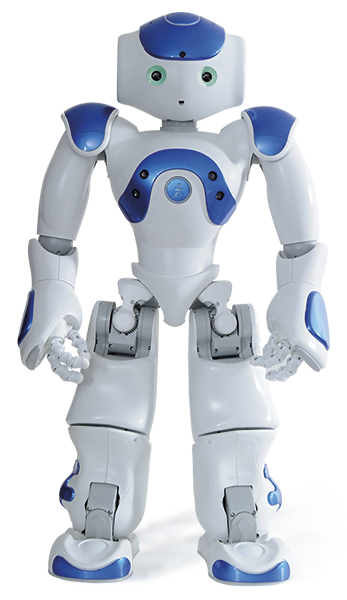
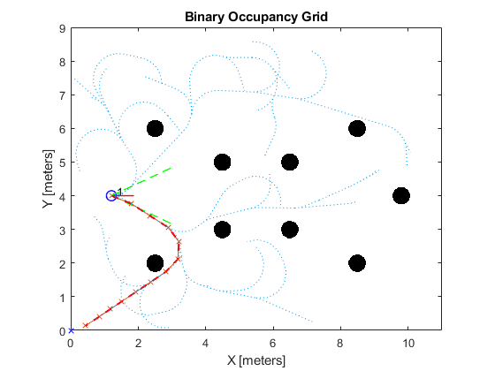

# RoboCup: Simulation of Humanoid Soccer with NAO6 Robots

## Abstract

This project offers a MATLAB-based simulation of the RoboCup with humanoid robots, particularly focusing on the Kid-size Humanoid Soccer League and utilizing the NAO6 robot design. The simulation serves as a comprehensive tool for analyzing and testing strategies and tactics, aligning with the RoboCup competition's guidelines and regulations. Key features include ball dynamics, shooting, dribbling, passing, and game state determination, as well as path planning techniques like RRT and Target-Interceptor. The simulation's decision-making relies on State flow, with specific conditions dictating court boundaries and robot roles. For more insights, view the full report on simulation validation, visualization, goals metrics, implications, limitations, and future recommendations.

|Overview|Nao6|
|:-:|:-:|
|<div align="left">Embark on a journey to understanding the world of RoboCup through a simulation, focusing on the Kid-size Humanoid Soccer League. This project provides insights into the robot's kinematics, actuators, and sensing capabilities for ball and fellow robots. The simulation is crafted with the aim to mirror the RoboCup competition, emphasizing ball dynamics, game states, and path planning techniques.</div>||

<div align="center">

:robot: Explore the [simulation in action](https://www.youtube.com/watch?v=VC431xcKnZw). :robot:

| Start | Occupancy Map |
|:-------------------:|:--------------:|
|   |  |

</div>

## Repository Contents

- **[MATLAB_Simulation](https://github.com/oscell/Robotics-team-design/tree/main/MATLAB)**: The primary workspace containing the MATLAB code for the simulation.

- **[Report](https://github.com/oscell/Robotics-team-design/blob/main/assets/Documents/Robocup_team_Report_TEAM_1.pdf)**: The comprehensive document detailing the entire development process, results, and further recommendations.

- **[Presentation](https://github.com/oscell/Robotics-team-design/blob/main/assets/Documents/Robotics%20team%20presentation.pdf)**: These slides summarise the developemnt 

## Setup & Installation

```bash
git clone https://github.com/oscell/Robotics-team-design.git
cd Robotics-team-design
```

Run `MATLAB/Main.m`

